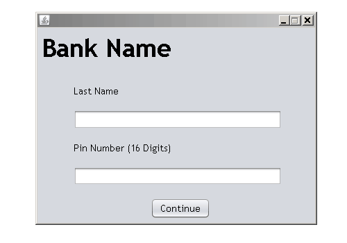
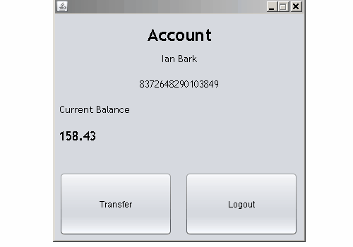

# BankApp

## Overview

Created with Java Swing, BankApp is a tool created to explore some of the basic features associated with mobile banking and accessing databases such transferring funds between two accounts and viewing account information.

### Login/Logout

### Transfer

## Dependencies

Java version: 8

Platform: Windows

Third party libraries: SQLite (soft, for editing database), JDBC

## Documentation

SQLite: https://sqlite.org/index.html

